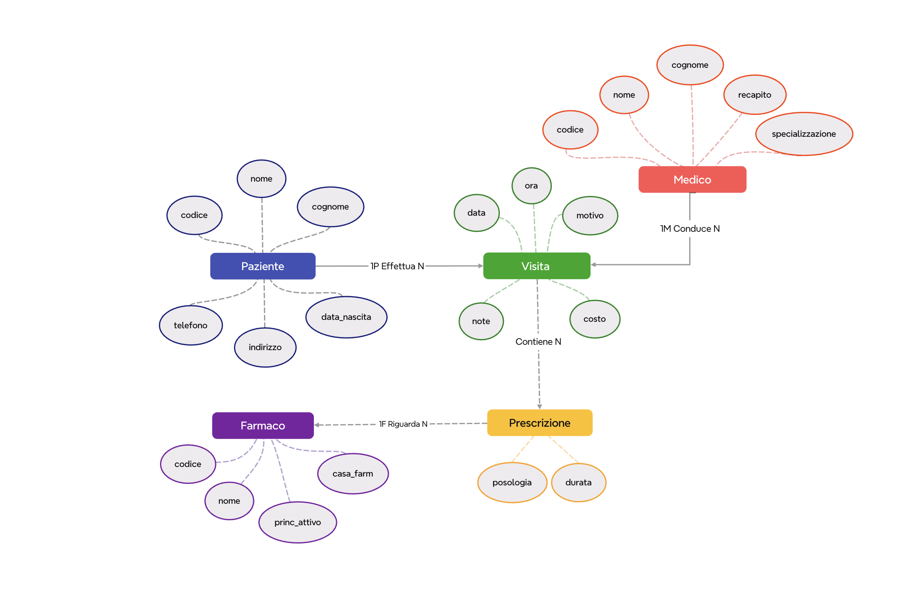

# Studio Medico

Studio Medico è un progetto semplice per creare e popolare un database SQLite relativo a pazienti, medici, visite, farmaci e prescrizioni. Il progetto include uno script Python per eseguire query SQL e visualizzare i risultati in modo leggibile.

## Struttura del progetto
In questo paragrafo è presente una breve introduzione dei file che compongono il progetto:

- schema.sql: contiene le istruzioni CREATE TABLE per il database SQLite
- dati.sql: contiene tutti gli INSERT INTO per popolare il database
- query.py: script Python che crea il database, esegue le query e stampa i risultati
- studio_medico.db: file del database SQLite generato automaticamente

## Schema del database
Il database contiene le seguenti tabelle (che può andare personalmente a verificare nel file "studio_medico.db")

- Paziente
  - codice (PRIMARY KEY)
  - nome
  - cognome
  - data_nascita
  - indirizzo
  - telefono

- Medico
  - codice (PRIMARY KEY)
  - nome
  - cognome
  - specializzazione
  - recapito

- Visita
  - id (PRIMARY KEY)
  - data
  - ora
  - motivo
  - note
  - costo
  - paziente_codice (FOREIGN KEY verso Paziente.codice)
  - medico_codice (FOREIGN KEY verso Medico.codice)

- Farmaco
  - codice (PRIMARY KEY)
  - nome
  - princ_attivo
  - casa_farm

- Prescrizione
  - id (PRIMARY KEY)
  - posologia
  - durata
  - visita_id (FOREIGN KEY verso Visita.id)
  - farmaco_codice (FOREIGN KEY verso Farmaco.codice)

Le relazioni principali sono:
- una visita appartiene a un paziente e a un medico
- una prescrizione è associata a una visita e a un farmaco

## Istruzioni per eseguire il progetto

1. Aprire il terminale nella cartella del progetto
2. Eseguire lo script Python:

```bash
python3 query.py
```

Se si desidera eseguire una query specifica, usare uno dei comandi descritti di seguito.

## Comandi disponibili

- `python3 query.py` → mostra l'elenco dei comandi disponibili
- `python3 query.py visite <codice_paziente>` → mostra tutte le visite di un paziente
- `python3 query.py farmaci-medico <codice_medico>` → mostra i farmaci prescritti da un medico
- `python3 query.py pazienti-medico <codice_medico>` → mostra i pazienti seguiti da un medico
- `python3 query.py farmaci-paziente <codice_paziente>` → mostra i farmaci presi da un paziente
- `python3 query.py spesa` → mostra la spesa totale di ogni paziente
- `python3 query.py visite-count` → mostra il numero di visite fatte da ogni paziente
- `python3 query.py prescrizioni-2025` → mostra tutte le prescrizioni dell'anno 2025
- `python3 query.py farmaco-pazienti` → mostra quali pazienti hanno ricevuto ciascun farmaco
- `python3 query.py tutto` → esegue tutte le query disponibili

# Schema Entità-Relazione (ER)
Lo schema ER rappresenta la struttura concettuale del database. 
Sono state identificate 5 entità principali:
 **Paziente**, **Medico**, **Visita**, **Farmaco** e **Prescrizione**
 E sono tutte collegate tra loro dalle seguenti relazioni:

- Un **Paziente** può effettuare più **Visite** (1:N)
- Un **Medico** conduce più **Visite** (1:N)
- Una **Visita** può generare più **Prescrizioni** (1:N)
- Una **Prescrizione** riguarda un **Farmaco** (N:1)

